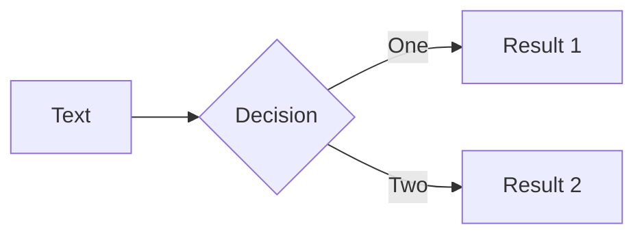
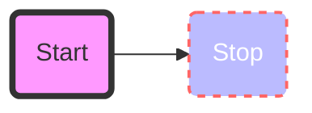
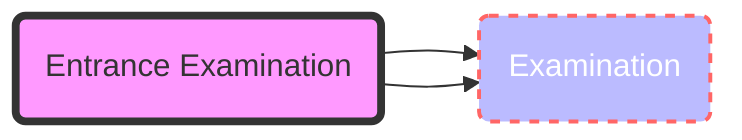
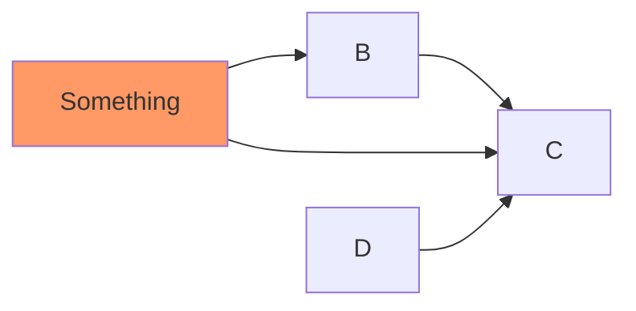
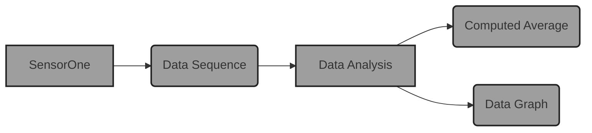
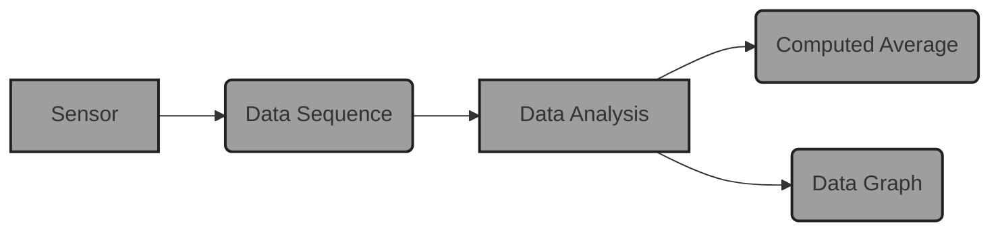

# Type Annotations in Python

<style>
  code {
    font-size: 36px;
  }
</style>

## Terribly Intimidating or Tremendously Informative?

<div class="container my-1">
 &nbsp;
</div>

### Gregory M. Kapfhammer

### PyOhio 2021

<div class="container my-5">
 &nbsp;
</div>

<v-click>

```python {all|1|2|all|2}
def start(t: Talk) -> Union[Fun, Info]:
def start(t: Talk) -> List[Fun, Info]:
```

</v-click>

---

---

# Okay, What Will I Learn?

<style>
  h2 {
    font-size: 36px;
    @apply text-orange-600 mb-4;
  }
</style>

<br>

<div v-click="1">

## Key questions

> What are the **benefits** and **challenges** associated with using type annotations
> inside of Python program? Will they help me be a better Python programmer?

</div>

<br>

<div v-click="2">

## Intended Audience

> What are the **benefits** and **challenges** associated with using type annotations
> inside of Python program? Will they help me be a better Python programmer?

</div>

<div v-click="3">

<div class="flex row">

<uim-rocket class="text-6xl ml-9 mt-5 text-blue-600" />

<div class="text-3xl font-bold mt-8 ml-4">
Let's explore type annotations in Python programs!
</div>

</div>

</div>

---

# Python Program without Annotations

<style>
</style>

<div class="-ml-9">

```python
def extract_urls(df: pandas.DataFrame) -> List[str]:
    """Extract a list of urls."""
    urls = []
    if "Url" in df.columns:
        urlc = df["Url"]
        if urlc is not None:
            urls = urlc.tolist()
    return urls
```

</div>

<br>

<v-clicks>

<p class = "bold">
What is the purpose of <code>df: pandas.DataFrame</code> ?
</p>

<p class = "bold">
How does <code>List[str]</code> describe output of <code>extract_urls</code> ?
</p>


</v-clicks>

---

# Hello World with Highlighting

```python {all|1|2-5|6|7-8|all}
# declare multiple variables
hello = "hello"
world = "world"
space = " "
value = .50
message = world + space + hello
print(f"The message is: {message}")
print(f"The value is: {value}")
```

<v-clicks>

<div class="absolute top-100 text-5xl font-extrabold bold-text">

<p class = "bold">
  Can you predict the output of this program?
</p>

<p class = "bold">
What is the purpose of <code>f"The message is: {message}"</code> ?
</p>

</div>

</v-clicks>

---

# Using a <code>mapper</code> with a Sequence

<br>

```python{all|1-3|4-9|10-12|all}
def square(value: int):
    return value * value

def mapper(f, sequence):
    result = (  )
    for element in sequence:
        result += ( f(element), )
    return result

squared_range = mappper(square, range(10))
print(squared_range)

```

---

# Understanding the Monoid

<v-clicks>

- A monoid is an ordered pair $(S, \otimes)$ for a set $S$ and any binary
operator $\otimes$ that satisfies the following conditions:

    - **Type Preservation**: $\forall s_1, s_2 \in S$, $s_1 \otimes
                  s_2 \in S$

    - **Associative Property**: $\forall s_1, s_2, s_3 \in S$, $(s_1
                  \otimes s_2) \otimes s_3 = s_1 \otimes (s_2 \otimes s_3)$

    - **Identity Element**: $\exists \epsilon \in S$, such that
        $\forall s \in S, \epsilon \otimes s = s$ and
        $s \otimes \epsilon = s$

-   We often say that $S$ is a monoid under $\otimes$ with identity
    $\epsilon$

-   If this is confusing, a monoid is a generalization of strings and integers!

-   If you know how strings behave in Python or Java then you understand the
monoid --- monoid describes <q>string-like</q> structures!

</v-clicks>

---

# Average Computation with Multisets

<style>
p {
  font-size: 25px;
}
</style>

<!--- Display all equations at the same time -->

$$O = ((o_1, \ldots, o_n))$$

$$S = \sum_{o_i \in O} o_i$$

$$A = \frac{S}{|O|}$$

What is the meaning of $o_i \in O$?

Where does this exist in Python code?

<p class = "bold">
Explore the use of the <code>sum</code> function in Python!
</p>

---

# Average Computation with Multisets

<style>
p {
  font-size: 25px;
}
</style>

<!--- Display each equation separately -->

<v-clicks>

$$O = ((o_1, \ldots, o_n))$$

$$S = \sum_{o_i \in O} o_i$$

$$A = \frac{S}{|O|}$$

What is the meaning of $o_i \in O$?

Where does this exist in Python code?

<p class = "bold">
Explore the use of the <code>sum</code> function in Python!
</p>

</v-clicks>

---

# Summary of the <q>Abstraction Jumping</q>

-   What is the connection between the discrete mathematical structures
    and the Python programs?

-   Connections between discrete mathematics and Python

    -   **Generic file**: a sequence of sequences

    -   **Names in the file**: a set of strings

    -   **Emails in the file**: a set of ordered pairs forming a
        relation

    -   **Temperatures in the file**: a multiset of integers

-   When might the emails in the file be a mapping? When might the
    temperatures in the file be a sequence?

---

# Simpler Slide with Bulleted List

<v-clicks>

- Item 1

  - Sub list
  - Sub list again

- Item 2
- Item 3
- Item 4

</v-clicks>

<div class="grid grid-cols-2 gap-x-1">

<uim-rocket class="text-8xl text-orange-400" />

<arrow x1="180" y1="420" x2="480" y2="420" color="#1c1c1c" width="3" arrowSize="1" />

<uim-rocket class="text-8xl text-orange-400" />

</div>

---
class: text-center
---

# Simple slid with some math

<v-click>

We often say that "$S$ is a monoid under $\otimes$ with identity $\epsilon$"

</v-click>

<v-click>



</v-click>

---

# Another exciting slide

<AutoFitText :max="80" :min="100" modelValue="How did I meet Mathew?"/>

---
class: center
---

# Another exciting slide

<div class="grid grid-cols-2 gap-x-1">








</div>

---

# Separate Diagram Slide

<div class="absolute top-30 left-40">



</div>

<div class="absolute top-80 left-20">

- What happens when I am typing a long message and I see some $f(x)$

</div>

---

# Separate Diagram Slide AGAIN!

<div class="container mx-auto px-25 py-5">



</div>

<div class="absolute top-80 left-20">

- What happens when I am typing a long message and I see some $f(x)$

</div>

---

# Separate Diagram Slide LAST

<div class="absolute top-30 left-40">


</div>

<div class="absolute top-80 left-20">

- What happens when I am typing a long message and I see some $f(x)$

</div>

